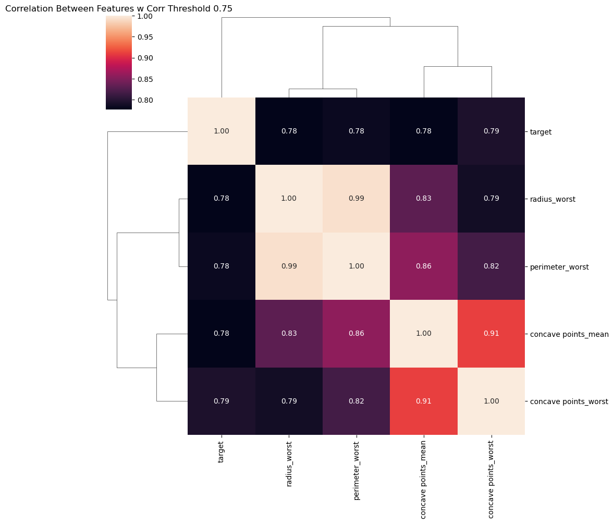
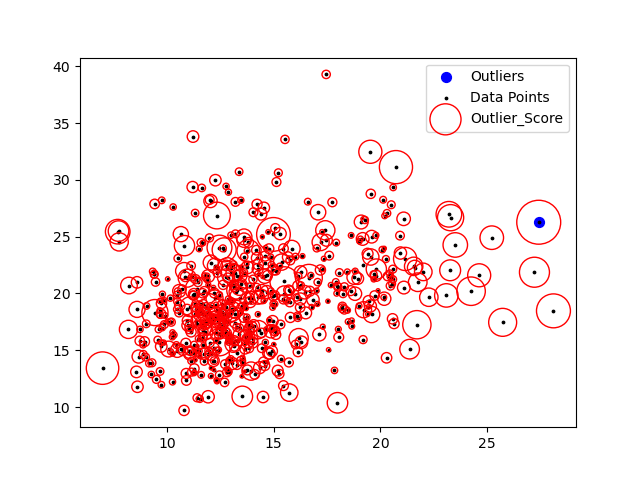
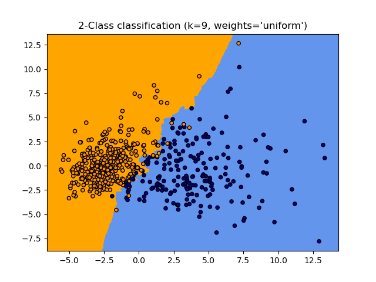
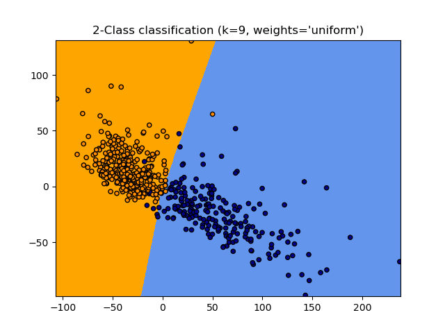
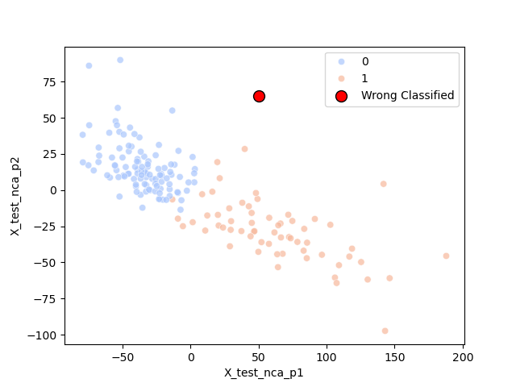

# 🧬 Breast Cancer Detection with KNN (PCA vs NCA Analysis)


**[🇹🇷 Türkçe Versiyonu İçin Tıklayınız / Click here for Turkish Version](#-proje-genel-bakış)**

---

<a name="english"></a>
## 🇬🇧 Project Overview

This project focuses on the classification of breast cancer tumors as **Malignant (M)** or **Benign (B)** using the **Wisconsin Breast Cancer Dataset**. The core machine learning algorithm employed is **K-Nearest Neighbors (KNN)**.

However, the primary objective of this study is not just classification, but a comparative analysis of **Dimensionality Reduction** techniques. We investigate how reducing the feature space affects the decision boundaries of the KNN classifier.

### 🔍 Key Techniques & Algorithms
1.  **K-Nearest Neighbors (KNN):** A distance-based classifier optimized using `GridSearchCV` to find the best hyperparameter ($k$).
2.  **Local Outlier Factor (LOF):** An unsupervised anomaly detection method used to identify and remove density-based outliers from the dataset.
3.  **PCA (Principal Component Analysis):** An *unsupervised* linear dimensionality reduction technique that projects data in the direction of maximum variance.
4.  **NCA (Neighborhood Components Analysis):** A *supervised* learning algorithm that learns a linear transformation to maximize the stochastic nearest neighbor classification accuracy.

---

### ⚙️ Workflow

1.  **Exploratory Data Analysis (EDA):** Analyzed feature distributions and correlations to understand data structure.
2.  **Data Cleaning:** Applied **LOF** to detect outliers and removed them to improve model generalization.
3.  **Preprocessing:**
    * Encoded target labels (M=1, B=0).
    * Applied **StandardScaler** (Crucial for KNN as it relies on Euclidean distance).
4.  **Model Tuning:** Used `GridSearchCV` to determine the optimal number of neighbors ($k$).
5.  **Dimensionality Reduction & Visualization:**
    * Reduced the 30-feature dataset to 2 dimensions using **PCA** and **NCA**.
    * Visualized and compared the decision boundaries.

---

### 📊 Visualizations & Results

#### 1. Correlation Analysis
Before selecting features, we examined the correlation matrix to see relationships between features and the diagnosis.


#### 2. Outlier Detection (LOF)
Using Local Outlier Factor, we identified samples that deviated significantly from the local density of their neighbors.


#### 3. The Showdown: PCA vs. NCA
This comparison highlights the effectiveness of supervised dimensionality reduction.

* **PCA Result:** PCA separates the data based on variance. While useful, the decision boundary is complex and classes overlap slightly.
    

* **NCA Result (Superior):** Since NCA uses the target labels during training, it learns a transformation that explicitly separates the classes. As seen below, the separation is distinct and the decision boundary is cleaner.
    

#### 4. Error Analysis
The final NCA-based KNN model achieved **~99% accuracy**. The plot below highlights the test set predictions, marking the **single misclassified point** in red.


---
---

<a name="turkish"></a>
## 🇹🇷 Proje Genel Bakış

Bu proje, **Wisconsin Meme Kanseri Veri Seti** kullanılarak tümörlerin **Kötü Huylu (M)** veya **İyi Huylu (B)** olarak sınıflandırılmasını hedefler. Temel makine öğrenmesi algoritması olarak **K-En Yakın Komşu (KNN)** kullanılmıştır.

Projenin asıl amacı sadece sınıflandırma yapmak değil, **Boyut İndirgeme (Dimensionality Reduction)** tekniklerinin model performansı ve karar sınırları üzerindeki etkisini karşılaştırmalı olarak analiz etmektir.

### 🔍 Kullanılan Teknikler ve Algoritmalar
1.  **K-En Yakın Komşu (KNN):** `GridSearchCV` kullanılarak en iyi komşu sayısı ($k$) optimize edilmiş ve sınıflandırma yapılmıştır.
2.  **Local Outlier Factor (LOF):** Veri setindeki yoğunluk tabanlı aykırı değerleri (outliers) tespit etmek ve temizlemek için kullanılan denetimsiz bir yöntemdir.
3.  **PCA (Temel Bileşen Analizi):** Veriyi varyansın en yüksek olduğu yöne iz düşüren, *denetimsiz* (unsupervised) bir boyut indirgeme yöntemidir.
4.  **NCA (Komşuluk Bileşenleri Analizi):** Sınıflandırma başarımını maksimize edecek doğrusal dönüşümü öğrenen, *denetimli* (supervised) bir yöntemdir.

---

### ⚙️ İş Akışı (Workflow)

1.  **Keşifçi Veri Analizi (EDA):** Veri yapısını anlamak için dağılımlar ve korelasyonlar incelendi.
2.  **Veri Temizleme:** **LOF** algoritması ile aykırı değerler tespit edildi ve veri setinden çıkarıldı.
3.  **Ön İşleme:**
    * Hedef değişkenler kodlandı (M=1, B=0).
    * **StandardScaler** uygulandı (KNN mesafe tabanlı bir algoritma olduğu için ölçeklendirme kritik önem taşır).
4.  **Hiperparametre Ayarı:** En uygun $k$ değerini bulmak için 10-katlı çapraz doğrulama (CV) ile `GridSearchCV` kullanıldı.
5.  **Boyut İndirgeme ve Görselleştirme:**
    * 30 özellikli veri seti **PCA** ve **NCA** ile 2 boyuta indirgendi.
    * Karar sınırları (decision boundaries) görselleştirilerek karşılaştırıldı.

---

### 📊 Görseller ve Sonuçlar

#### 1. Korelasyon Analizi
Özelliklerin birbirleriyle ve teşhis (target) ile olan ilişkisini gösteren ısı haritası.


#### 2. Aykırı Değer Tespiti (LOF)
Veri setinin genel yoğunluğundan sapan noktalar tespit edilerek temizlendi.


#### 3. Karşılaştırma: PCA ve NCA
Bu bölüm projenin en önemli çıktısıdır.

* **PCA Sonucu:** PCA varyansa odaklandığı için sınıfları ayırmada fena değildir ancak karar sınırları karmaşıktır.
    

* **NCA Sonucu (Kazanan):** NCA, eğitim sırasında etiketleri (labels) kullandığı için sınıfları birbirinden uzaklaştırmayı öğrenir. Aşağıda görüldüğü üzere, **Mavi ve Turuncu alanlar çok daha net ayrılmıştır.**
    

#### 4. Hata Analizi
NCA destekli KNN modelimiz test setinde **%99 başarı** göstermiştir. Aşağıdaki grafikte modelin yanlış tahmin ettiği **tek bir nokta** kırmızı ile işaretlenmiştir.


---

## 📂 Folder Structure / Dosya Yapısı

```text
Breast-Cancer-KNN-Analysis/
│
├── data/
│   └── data.csv          # Dataset
│
├── images/               # Generated Plots / Oluşturulan Grafikler
│   ├── correlation_heatmap.png
│   ├── outlier_detection.png
│   ├── pca_boundary.png
│   ├── nca_boundary.png
│   └── wrong_classified.png
│
├── src/
│   └── proje1.py         # Main Source Code / Ana Kaynak Kod
│
├── models/               # Saved Models / Kaydedilen Modeller
├── results/              # Analysis Results / Analiz Sonuçları
├── requirements.txt      # Dependencies / Gerekli Kütüphaneler
└── README.md             # Project Documentation
🚀 How to Run / Nasıl Çalıştırılır?
Clone the repository / Repoyu klonlayın:

Bash

git clone [https://github.com/busrademirrr/Breast-Cancer-KNN-Analysis.git](https://github.com/busrademirrr/Breast-Cancer-KNN-Analysis.git)
Install dependencies / Gerekli kütüphaneleri yükleyin:

Bash

pip install -r requirements.txt
Run the script / Kodu çalıştırın:

Bash

cd src
python proje1.py
🔗 Author / Yazar
Büşra Demir GitHub Profile
